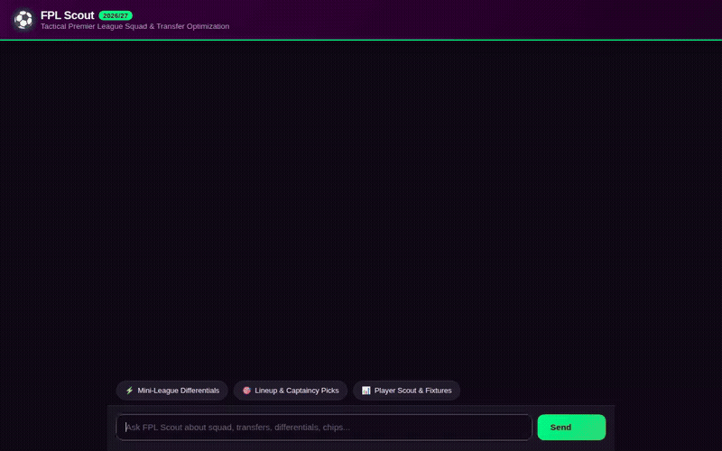

# ⚽ FPL Scout — Fantasy Premier League Tactical Agent

An agentic AI assistant designed for **Fantasy Premier League (FPL)** managers. Built with Google's **Agent Development Kit (ADK)**, powered by **Gemini 3.6 Flash**, and integrated with **A2UI**, **Vertex AI Memory Bank**, **Google Cloud Storage**, **Firestore**, and **Cloud Run**.



---

## 📌 What FPL Scout Does

FPL Scout is a data-driven assistant that helps managers make mathematically sound decisions for upcoming Premier League gameweeks:

1. **Mini-League Differential Scouting**:
   - Analyzes competitor squads in your mini-league to pinpoint low-ownership (<20%), high-upside differential players with favorable upcoming fixtures to help you gain rank.
2. **Lineup & Captaincy Engine**:
   - Recommends the optimal starting 11, vice-captain backup, and bench ordering based on form, expected goals/assists (xG/xA), and fixture difficulty ratings (FDR).
3. **Transfer Hit Calculator**:
   - Evaluates whether taking a `-4` or `-8` point deduction is mathematically justifiable over a multi-gameweek horizon.
4. **Interactive A2UI Cards (v0.8 Basic Catalog)**:
   - Dynamic UI surfaces rendered in the chat (squad tables, scouting cards, chip activation banners, and gameweek status summaries).
5. **Multimodal Media Generation**:
   - **Tactical Pitch Formations & Radar Cards**: Generated via `gemini-3.1-flash-lite-image` and saved both locally as artifacts and uploaded to Google Cloud Storage.
   - **Highlight Clips**: Generated via `gemini-omni-flash-preview` using the Interactions API in the `global` region and uploaded directly to Google Cloud Storage.
6. **Cross-Session Memory Bank**:
   - Uses Vertex AI Memory Bank (`shared://memory`) to retain user manager ID, favorite clubs, mini-league IDs, chip history, and watchlists across conversations.

---

## 🛠️ Actually Implemented Tools & Services

Based directly on `app/agent.py` and `agents-cli-manifest.yaml`, the following services and tools are wired up:

### Google Cloud Services
- **Vertex AI Reasoning Engine / ADK Agent Runtime**: Orchestrates conversational flow, tool execution, and callbacks.
- **Gemini Models**:
  - `gemini-3.6-flash` (in `global` region) for reasoning, tactical advice, and tool calling.
  - `gemini-3.1-flash-lite-image` (in `global` region) for pitch formation graphics and scouting radar cards.
  - `gemini-omni-flash-preview` (in `global` region via Interactions API) for short highlight video generation.
- **Vertex AI Memory Bank**: Persistent cross-session user memory via `VertexAiMemoryBankService`.
- **Google Cloud Storage (GCS)**: Public bucket storage for generated images and videos.
- **Cloud Firestore**: Database collections for manager profiles, team fixtures, and player metadata.
- **Cloud Run**: Production deployment of the FastAPI proxy and branded chat UI.

### Active Agent Tools
- `recommend_gameweek_differentials`: Analyzes mini-league rivals and identifies low-ownership differential picks.
- `recommend_captain`: Determines primary and vice-captain choices based on FDR and expected returns.
- `get_squad_lineup_and_chips`: Fetches current team lineup, bench order, and active/available chips.
- `evaluate_transfer_hit`: Calculates whether points hits (-4/-8) yield net expected value.
- `generate_fpl_visual`: Generates tactical pitch formations or graphics using `gemini-3.1-flash-lite-image` and uploads to GCS.
- `generate_player_scout_card`: Creates FIFA Ultimate Team-style radar scouting cards for players.
- `generate_chip_activation_banner`: Generates broadcast-style banners for Wildcard, Triple Captain, Free Hit, or Bench Boost.
- `generate_fpl_highlight_video`: Generates short video clips using `gemini-omni-flash-preview` and uploads to GCS.
- `get_saved_watchlist`, `save_player_to_watchlist`, `remove_player_from_watchlist`: Manages the manager's personal target list in Firestore.
- `get_my_team_and_leagues`, `get_mini_league_standings`, `check_gameweek_status`, `get_player_stats`, `check_team_fixtures`: Live stats and fixture queries.

---

## 💻 Local Setup & Running Instructions

### 1. Prerequisites
- Python 3.11+
- `uv` package manager (`curl -LsSf https://astral.sh/uv/install.sh | sh`)
- Google Cloud SDK (`gcloud`) authenticated to your GCP project:
  ```bash
  gcloud auth login
  gcloud auth application-default login
  ```

### 2. Running the Agent Playground Locally
Start the local ADK developer playground connected to your Memory Bank:
```bash
uv run adk web . --port 8000 --reload_agents --memory_service_uri=agentengine://<YOUR_MEMORY_BANK_ID>
```

### 3. Running the Chat Frontend Locally
In a separate terminal, run the branded chat UI and proxy server:
```bash
cd frontend
export AGENT_ENGINE_RESOURCE_NAME="projects/<PROJECT_ID>/locations/<REGION>/reasoningEngines/<REASONING_ENGINE_ID>"
export AGENT_DIRECTORY="app"
uvicorn main:app --host 0.0.0.0 --port 8080
```
Open your browser to `http://localhost:8080` to chat with the agent.

---

## 📂 Repository Structure

```
├── app/
│   ├── a2ui/                  # Vendored A2UI v0.8 core package
│   ├── app_utils/             # Service definitions & memory bank
│   ├── agent.py               # Root ADK agent with Gemini 3.6 Flash & callbacks
│   ├── a2ui_utils.py          # A2UI callback hooks and schemas
│   ├── fast_api_app.py        # Local API server definition
│   ├── firestore_service.py   # Firestore database integrations
│   ├── fpl_service.py         # Official Premier League data fetchers
│   ├── image_service.py       # gemini-3.1-flash-lite-image & GCS uploader
│   ├── video_service.py       # gemini-omni-flash-preview & GCS uploader
│   └── tools.py               # FPL stats, differential picks & captaincy engine
├── frontend/
│   ├── static/
│   │   └── index.html         # Branded chat UI with A2UI card renderer
│   ├── main.py                # FastAPI proxy communicating via A2A protocol
│   └── requirements.txt       # Frontend dependencies
├── APIS_AND_GEMINI_FEATURES.md # Complete index of APIs and AI models
├── agents-cli-manifest.yaml   # Manifest for agents-cli deployment
├── deployment_metadata.json   # Deployed Reasoning Engine ID & metadata
├── demo.gif                   # Screen-captured demo video of the agent
├── fpl_scout_demo.webm        # Raw screen recording
├── project_brief.md           # Project specification
└── pyproject.toml             # Python dependencies
```
